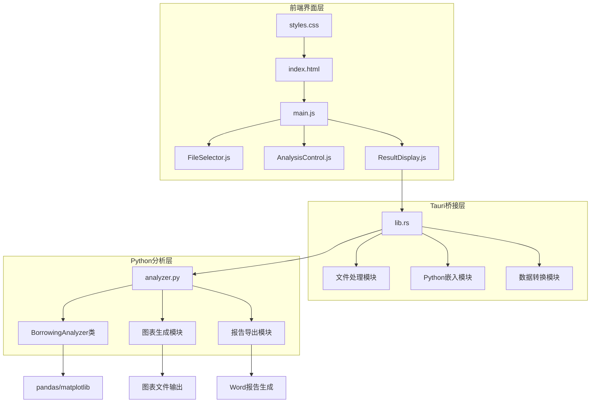
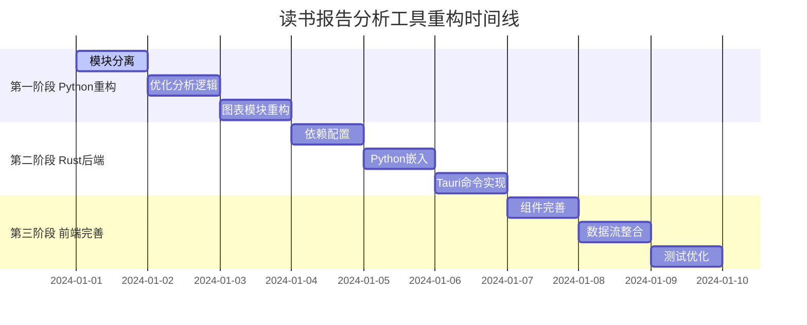

# 读书报告分析工具重构实施计划

## 📋 项目概览

将现有的Python借阅分析脚本重构为基于Tauri的桌面应用，使用pyo3嵌入Python分析逻辑，前端采用HTML+CSS+JS构建。

## 🎯 技术架构

### 架构设计图



### 技术栈选择

- **前端**: HTML5 + CSS3 + Vanilla JavaScript
- **后端**: Rust (Tauri 2.0)
- **Python集成**: pyo3 (直接嵌入)
- **数据处理**: pandas + matplotlib
- **文件处理**: calamine (Excel读取)
- **报告生成**: python-docx

## ⏰ 实施时间线

### 总体安排：6-8天



## 🐍 第一阶段：Python模块重构 (3天)

### 目标
将现有单体Python脚本重构为模块化结构，移除GUI依赖，优化分析逻辑。

### Day 1: 核心模块分离
**任务清单：**
- [ ] 从main.py中提取BorrowingAnalyzer类
- [ ] 创建独立的analyzer.py模块
- [ ] 移除GUI依赖（tkinter文件选择）
- [ ] 添加数据验证逻辑
- [ ] 重构初始化和数据加载方法

**关键代码结构：**
```python
# src-tauri/python/analyzer.py
class BorrowingAnalyzer:
    def __init__(self):
        self.data = None
        self.member_data = None
        self.results = None
    
    def load_excel_files(self, borrow_paths, member_path):
        """加载Excel数据文件"""
        pass
```

### Day 2: 分析逻辑优化
**任务清单：**
- [ ] 重构analyze()方法，添加进度回调接口
- [ ] 优化calculate_actual_weeks()方法
- [ ] 改进categorycode2name()映射逻辑
- [ ] 完善全勤月统计算法
- [ ] 加强错误处理和异常管理

**核心功能：**
- 借阅时长计算
- 月度统计分析
- 全勤月识别
- 数据汇总生成

### Day 3: 图表模块重构
**任务清单：**
- [ ] 重构plot_duration()方法，确保透明背景
- [ ] 重构plot_books_per_month()折线图生成
- [ ] 重构plot_category()饼图生成
- [ ] 统一图表输出格式和尺寸
- [ ] 创建图表配置管理
- [ ] 优化Word报告生成逻辑

**图表要求：**
- 背景透明
- 统一尺寸 (10x6英寸)
- 中文字体支持
- 高分辨率输出

## ⚙️ 第二阶段：Rust后端实现 (3天)

### 目标
构建Tauri后端架构，集成Python分析模块，实现前后端通信。

### Day 4: 基础设施搭建
**任务清单：**
- [ ] 更新Cargo.toml依赖配置
- [ ] 创建Python嵌入管理模块
- [ ] 设置项目结构和模块划分
- [ ] 配置pyo3集成环境

**依赖更新：**
```toml
[dependencies]
pyo3 = { version = "0.22", features = ["auto-initialize"] }
calamine = "0.24"
tokio = { version = "1.0", features = ["full"] }
anyhow = "1.0"
thiserror = "1.0"
```

### Day 5: 核心功能实现
**任务清单：**
- [ ] 实现analyze_files Tauri命令
- [ ] 创建文件处理和数据转换逻辑
- [ ] 实现进度通知机制
- [ ] 建立Python-Rust数据交换格式

**核心命令接口：**
```rust
#[tauri::command]
async fn analyze_files(
    reader_list_path: String,
    borrow_paths: Vec<String>
) -> Result<AnalysisResult, String>

#[tauri::command]
async fn select_files(multiple: bool) -> Result<Vec<String>, String>
```

### Day 6: 系统集成
**任务清单：**
- [ ] 完善错误处理和日志记录
- [ ] 优化性能和内存管理
- [ ] 添加输出文件管理
- [ ] 实现临时文件清理机制

## 🎨 第三阶段：前端完善 (2天)

### 目标
完善用户界面，实现完整的用户体验，确保前后端数据流畅通。

### Day 7: 组件功能完善
**任务清单：**
- [ ] 改进FileSelector.js使用Tauri文件API
- [ ] 完善AnalysisControl.js进度显示逻辑
- [ ] 实现ResultDisplay.js数据展示功能
- [ ] 优化样式和用户交互体验

**组件架构：**
```javascript
// 文件选择组件
export class FileSelector {
    async selectFiles() {
        const files = await invoke('select_files', { multiple: true });
        return files;
    }
}

// 分析控制组件
export class AnalysisControl {
    async startAnalysis(files) {
        const result = await invoke('analyze_files', files);
        return result;
    }
}
```

### Day 8: 最终整合测试
**任务清单：**
- [ ] 前后端数据流完整测试
- [ ] 用户界面响应性优化
- [ ] 错误处理机制验证
- [ ] 完整功能流程测试
- [ ] 性能优化和内存泄漏检查

## 📁 项目文件结构

```
ReaderReport/
├── src-tauri/
│   ├── src/
│   │   ├── main.rs
│   │   ├── lib.rs
│   │   ├── python_analyzer.rs    # 新增 - Python嵌入管理
│   │   ├── file_handler.rs       # 新增 - 文件处理逻辑
│   │   └── commands.rs           # 新增 - Tauri命令定义
│   ├── python/
│   │   └── analyzer.py           # 新增 - 重构的分析模块
│   └── Cargo.toml               # 更新依赖
├── src/
│   ├── components/
│   │   ├── FileSelector.js       # 完善 - 文件选择组件
│   │   ├── AnalysisControl.js    # 完善 - 分析控制组件
│   │   └── ResultDisplay.js      # 完善 - 结果显示组件
│   ├── index.html               # 基础HTML结构
│   ├── main.js                  # 完善 - 主应用逻辑
│   └── styles.css               # 完善 - 样式文件
├── plans/
│   ├── init_plan.md            # 初始方案
│   └── implementation_plan.md   # 本实施计划
└── main.py                     # 原始Python脚本（参考）
```

## 🔧 核心技术实现

### Python模块接口设计
```python
class BorrowingAnalyzer:
    def load_excel_files(self, borrow_paths, member_path):
        """加载Excel数据文件，返回加载状态"""
        
    def analyze_with_progress(self, progress_callback=None):
        """执行分析并提供进度回调"""
        
    def generate_all_charts(self, output_dir):
        """生成所有图表到指定目录，返回文件路径列表"""
        
    def export_word_report(self, output_path):
        """导出完整的Word报告"""
        
    def get_analysis_results(self):
        """获取分析结果的结构化数据"""
```

### Rust数据结构设计
```rust
#[derive(Debug, Serialize, Deserialize)]
pub struct AnalysisResult {
    pub borrow_frequency: u32,
    pub total_duration: String,
    pub total_price: f64,
    pub monthly_borrow: HashMap<u8, u32>,
    pub longest_author: String,
    pub longest_category: String,
    pub borrow_peak: u8,
    pub most_borrowed_book: String,
    pub most_borrowed_book_count: u32,
    pub full_attendance: Vec<String>,
    pub total_full_attendance: u32,
    pub chart_paths: Vec<String>,
}
```

### 前端数据流设计
```javascript
// 主应用数据流
const workflow = {
    1: "用户选择文件 (FileSelector)",
    2: "验证文件格式和内容",
    3: "调用后端分析 (invoke analyze_files)",
    4: "显示分析进度 (AnalysisControl)",
    5: "展示分析结果 (ResultDisplay)",
    6: "提供报告导出功能"
};
```

## 🎯 预期成果

### 功能特性
1. **完整功能移植**：保持原Python脚本的所有分析功能
2. **现代化界面**：直观的GUI界面，支持拖拽文件选择
3. **实时反馈**：分析进度显示，操作状态提示
4. **性能优化**：Rust处理文件IO，提升整体性能
5. **部署简便**：单一可执行文件，无需Python环境

### 技术优势
1. **跨平台支持**：Windows、macOS、Linux
2. **内存安全**：Rust所有权机制防止内存泄漏
3. **模块化设计**：便于后续功能扩展和维护
4. **类型安全**：强类型系统减少运行时错误
5. **现代化工具链**：使用最新的Web技术栈

### 用户体验
1. **三步操作流程**：选择文件 → 点击分析 → 查看结果
2. **智能错误提示**：友好的错误信息和解决建议
3. **批量处理**：支持多个读者数据同时分析
4. **灵活导出**：支持多种格式的报告导出
5. **响应式设计**：适配不同屏幕尺寸

## 📝 实施注意事项

### 关键风险点
1. **Python依赖管理**：确保pyo3正确集成所需的Python包
2. **数据格式兼容**：保持与原始Excel文件格式的完全兼容
3. **图表渲染**：确保matplotlib在嵌入环境中正常工作
4. **内存管理**：处理大量数据时的内存优化
5. **错误处理**：跨语言调用的异常传播

### 质量保证
1. **功能对比测试**：与原Python脚本输出结果对比
2. **性能基准测试**：分析处理速度和内存使用
3. **兼容性测试**：不同操作系统和Python版本
4. **用户体验测试**：界面响应性和易用性
5. **边界条件测试**：异常数据和极端情况处理

---

*本实施计划基于现有的Python脚本功能和Tauri框架特性制定，旨在创建一个现代化、高性能的桌面应用程序。*