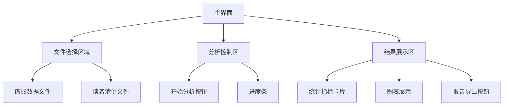

### 脚本功能总结
该Python脚本是一个图书借阅数据分析工具，主要功能包括：
1. **数据读取**：通过GUI选择多个借阅数据Excel文件和一个读者清单Excel文件
2. **核心分析**：
   - 计算借阅时长、总借阅频次
   - 统计会员总时长（从办卡日期起）
   - 计算借阅书籍总价值
   - 分析每月借阅时长和数量
   - 识别阅读时长最长的书籍/作者/类别
   - 找出借阅高峰期和热门书籍
   - **全勤月统计**（每月每周都有借书记录）
3. **可视化**：
   - 书籍阅读时长条形图（静态/GIF）
   - 月度借阅频次折线图（静态/GIF）
   - 书籍类别分布饼图（静态/GIF）
4. **报告生成**：将分析结果和图表保存为Word文档

### Tauri重构方案

#### 重点注意事项
1. 需要有一次性分析多个读者借阅数据的功能，预览页面可以切换预览不同读者，但导出时所有读者的报告全部导出，每个读者一个文件夹
2. 导出的表格图片的背景应是透明的，而不是白色
3. 注意原脚本实现中读取excel的方式（例如都有哪些数据、如何预处理表格、读取了那一列的数据等），在重构时要保持一致，以免新程序无法识别数据文件。

#### 前端界面设计（Rust + WebView）


#### 功能实现逻辑

1. **文件选择模块**
   ```rust
   // Rust后端
   #[tauri::command]
   async fn select_files() -> Vec<PathBuf> {
       let dialog = FileDialogBuilder::new()
           .add_filter("Excel", &["xlsx", "xls"])
           .set_multiselect(true)
           .pick_files();
       dialog.unwrap_or_default()
   }
   ```
   **注意**：需要处理跨平台路径差异，使用`std::path::PathBuf`

2. **数据分析核心**
   ```python
   # 保持现有Python分析逻辑
   # 通过tauri-sidecar嵌入Python解释器
   ```
   **优化点**：
   - 将`BorrowingAnalyzer`类拆分为独立模块
   - 添加进度回调接口
   - 使用`pyo3`创建Rust-Python绑定

3. **全勤月统计逻辑**
   ```python
   # 获取月份所有ISO周
   dates = [first_day + timedelta(days=i) for i in range(days_in_month)]
   iso_weeks = {f"{d.isocalendar()[0]}-{d.isocalendar()[1]:02d}" for d in dates}
   
   # 对比实际借阅周数
   actual_weeks = df[df['年月'] == month]['ISO周'].nunique()
   is_full = actual_weeks == len(iso_weeks)
   ```
   **功能建议**：提供可选开关，在分析报告中添加显示非全勤月所缺少的周数，便于确认。
   

4. **可视化渲染**
   ```rust
   // Rust前端
   #[tauri::command]
   fn render_chart(data: AnalysisResult) -> ChartResult {
       match chart_type {
           "duration" => render_bar_chart(&data.sorted_duration),
           "monthly" => render_line_chart(&data.monthly_borrow),
           "category" => render_pie_chart(&data.category_count)
       }
   }
   ```
   **替代方案**：使用`plotters`库直接生成SVG
   **注意事项**：需要把所有的图表都导出为单独的图片文件。

5. **报告生成**
   ```rust
   // 使用rust-docx库
   fn generate_report(result: AnalysisResult) -> PathBuf {
       let doc = DocxFile::new();
       doc.add_heading("借阅分析报告", 1);
       doc.add_table(result.summary_table);
       doc.add_image("chart1.png");
       doc.save(output_path)
   }
   ```

#### 关键实现细节

1. **线程管理**
   ```rust
   // 防止UI阻塞
   thread::spawn(move || {
       let result = analyzer.analyze();
       window.emit("analysis-progress", result).unwrap();
   });
   ```

2. **跨语言通信**
   ```rust
   // 定义统一数据接口
   #[derive(Serialize, Deserialize)]
   struct AnalysisResult {
       borrow_frequency: u32,
       total_duration: String,
       // ...其他字段
   }
   ```

3. **错误处理**
   ```rust
   // 统一错误处理
   #[derive(Debug, thiserror::Error)]
   enum AnalysisError {
       #[error("文件读取失败")]
       IoError(#[from] std::io::Error),
       #[error("数据分析异常")]
       PythonError(String)
   }
   ```

4. **性能优化**
   - 使用`polars`替代`pandas`（Rust原生DataFrame库）
   - 增量渲染图表（大数据集）
   - 缓存机制避免重复分析

### 全勤月统计方案对比

| 方案 | 准确性 | 复杂度 | 跨月处理 | 执行效率 |
|------|--------|--------|----------|----------|
| **ISO周集合比对** | 高 | 中 | 完善 | O(n) |
| **连续日期差值** | 中 | 高 | 易出错 | O(n log n) |
| **周分组计数** | 高 | 低 | 完善 | O(1) |

**推荐实现**：
```python
def calculate_full_attendance(df):
    # 生成日期范围
    date_range = pd.date_range(df['借书日期'].min(), df['还书日期'].max(), freq='D')
    
    # 创建周计数框架
    week_frame = pd.DataFrame({
        'year_week': [f"{d.isocalendar().year}-{d.isocalendar().week:02d}" 
                      for d in date_range]
    }).drop_duplicates()
    
    # 合并借阅数据
    df['year_week'] = df['借书日期'].apply(
        lambda x: f"{x.isocalendar().year}-{x.isocalendar().week:02d}")
    
    # 统计全勤月
    monthly_weeks = df.groupby('年月')['year_week'].nunique()
    expected_weeks = week_frame.groupby(
        week_frame['year_week'].str[:7])['year_week'].nunique()
    
    return monthly_weeks.eq(expected_weeks).sum()
```

### 架构优势
1. **安装便捷**：单一可执行文件（无需Python环境）
2. **响应速度**：Rust多线程处理IO密集型任务
3. **内存安全**：Rust所有权机制防止内存泄漏
4. **跨平台**：支持Windows/macOS/Linux
5. **用户体验**：实时进度反馈 + 交互式图表

最终应用将提供三步操作流程：
1. 选择借阅文件和读者清单
2. 点击分析按钮
3. 查看/导出报告

相比原脚本，使用更加简便。