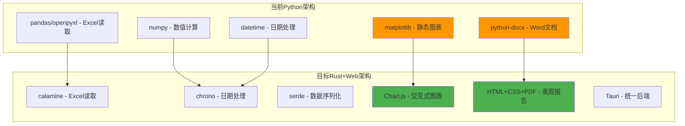
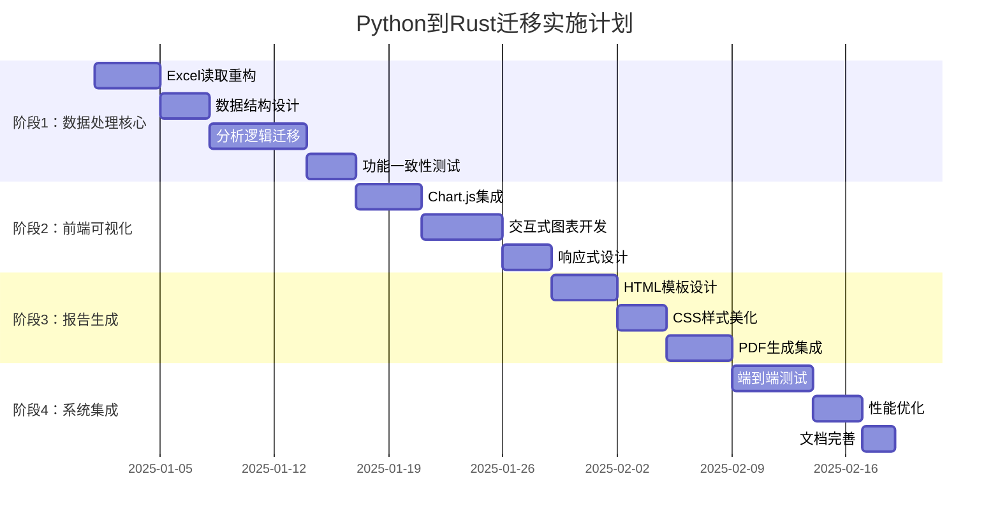

# Python分析器迁移到纯Rust技术栈计划

## 📋 项目概述

### 🎯 核心目标
- **主要动机**：解决Python依赖部署问题，简化用户安装过程
- **迁移范围**：完全迁移所有功能到Rust后端 + Web前端技术栈
- **技术原则**：保证数据分析功能完全一致，提升用户体验和美观性

### 🏗️ 技术架构调整



## 🔍 详细技术可行性分析

### ✅ 技术组件映射

| Python组件 | Rust/Web替代方案 | 可行性 | 复杂度 | 优势 |
|------------|-----------------|-------|--------|------|
| pandas + openpyxl | calamine | ✅ 高 | 🟢 低 | 已集成，性能更好 |
| numpy计算 | 原生Rust | ✅ 高 | 🟡 中 | 类型安全，更快 |
| matplotlib | Chart.js | ✅ 高 | 🟢 低 | 交互性强，响应式 |
| python-docx | HTML+CSS→PDF | ✅ 高 | 🟡 中 | 更美观，易定制 |
| datetime | chrono | ✅ 高 | 🟢 低 | 功能完整，性能优秀 |

## 📅 实施路线图



## 🔧 详细实施方案

### 阶段1️⃣：数据处理核心 (Rust后端)

#### 📊 新增核心模块：`src-tauri/src/rust_analyzer.rs`

```rust
use calamine::{Reader, open_workbook, Xlsx, DataType};
use chrono::{NaiveDate, Datelike, IsoWeek};
use serde::{Serialize, Deserialize};
use std::collections::HashMap;

#[derive(Debug, Serialize, Deserialize, Clone)]
pub struct BorrowRecord {
    pub name: String,
    pub book_title: String,
    pub author: String,
    pub category: String,
    pub borrow_date: NaiveDate,
    pub return_date: NaiveDate,
    pub price: f64,
    pub duration_days: i64,
}

#[derive(Debug, Serialize, Deserialize, Clone)]
pub struct MemberRecord {
    pub name: String,
    pub registration_date: NaiveDate,
}

pub struct RustAnalyzer {
    borrow_data: Vec<BorrowRecord>,
    member_data: Vec<MemberRecord>,
}

impl RustAnalyzer {
    pub fn new() -> Self {
        Self {
            borrow_data: Vec::new(),
            member_data: Vec::new(),
        }
    }
    
    pub fn load_excel_files(&mut self, borrow_paths: Vec<String>, member_path: String) -> Result<(), String> {
        // 使用calamine读取Excel文件
        // 实现与Python版本完全相同的数据加载逻辑
    }
    
    pub fn analyze(&self) -> Result<AnalysisResult, String> {
        // 重现Python分析器的所有统计逻辑
        // 确保结果100%一致
    }
}
```

#### 🔄 数据一致性保证策略

```rust
#[cfg(test)]
mod consistency_tests {
    use super::*;
    
    #[test]
    fn test_analysis_consistency_with_python() {
        // 使用相同测试数据集
        // 对比Rust和Python实现的结果
        // 确保数值计算完全一致
    }
    
    #[test]
    fn test_iso_week_calculation() {
        // 专门测试ISO周计算逻辑
        // 这是复杂度较高的部分
    }
}
```

### 阶段2️⃣：前端可视化升级 (Web技术栈)

#### 📈 交互式图表模块：`src/components/InteractiveCharts.js`

```javascript
import Chart from 'chart.js/auto';
import ChartDataLabels from 'chartjs-plugin-datalabels';

export class InteractiveCharts {
    constructor() {
        Chart.register(ChartDataLabels);
        this.charts = new Map();
    }
    
    // 替代matplotlib的静态图表，提供更好的交互体验
    createBookDurationChart(containerId, data) {
        const ctx = document.getElementById(containerId).getContext('2d');
        const chart = new Chart(ctx, {
            type: 'bar',
            data: {
                labels: Object.keys(data),
                datasets: [{
                    label: '阅读时长 (天)',
                    data: Object.values(data),
                    backgroundColor: 'rgba(54, 162, 235, 0.8)',
                    borderColor: 'rgba(54, 162, 235, 1)',
                    borderWidth: 1
                }]
            },
            options: {
                responsive: true,
                maintainAspectRatio: false,
                plugins: {
                    legend: {
                        display: true,
                        position: 'top'
                    },
                    tooltip: {
                        enabled: true,
                        mode: 'index',
                        intersect: false
                    }
                },
                scales: {
                    y: {
                        beginAtZero: true,
                        title: {
                            display: true,
                            text: '天数'
                        }
                    }
                }
            }
        });
        
        this.charts.set(containerId, chart);
        return chart;
    }
    
    createMonthlyBorrowChart(containerId, data) {
        // 月度借阅趋势图，支持缩放和悬停
    }
    
    createCategoryPieChart(containerId, data) {
        // 类别分布饼图，支持点击展开
    }
    
    // 图表导出功能
    exportChartAsPNG(chartId) {
        const chart = this.charts.get(chartId);
        return chart.toBase64Image();
    }
}
```

#### 🎨 美观度提升要点

```css
/* src/styles/charts.css */
.chart-container {
    background: linear-gradient(135deg, #667eea 0%, #764ba2 100%);
    border-radius: 15px;
    padding: 20px;
    box-shadow: 0 10px 30px rgba(0, 0, 0, 0.2);
    margin: 20px 0;
}

.chart-title {
    font-size: 1.5em;
    font-weight: bold;
    color: white;
    text-align: center;
    margin-bottom: 15px;
}

.interactive-legend {
    display: flex;
    justify-content: center;
    gap: 15px;
    margin-top: 10px;
}
```

### 阶段3️⃣：HTML+CSS报告生成系统

#### 📄 美观报告模板：`src/templates/report_template.html`

```html
<!DOCTYPE html>
<html lang="zh-CN">
<head>
    <meta charset="UTF-8">
    <meta name="viewport" content="width=device-width, initial-scale=1.0">
    <title>个人读书分析报告</title>
    <style>
        @import url('https://fonts.googleapis.com/css2?family=Noto+Sans+SC:wght@300;400;500;700&display=swap');
        
        body {
            font-family: 'Noto Sans SC', sans-serif;
            line-height: 1.6;
            color: #333;
            max-width: 1200px;
            margin: 0 auto;
            padding: 40px 20px;
            background: linear-gradient(135deg, #f5f7fa 0%, #c3cfe2 100%);
        }
        
        .report-header {
            text-align: center;
            background: white;
            padding: 40px;
            border-radius: 20px;
            box-shadow: 0 15px 35px rgba(0, 0, 0, 0.1);
            margin-bottom: 30px;
        }
        
        .report-title {
            font-size: 2.5em;
            font-weight: 700;
            background: linear-gradient(45deg, #667eea, #764ba2);
            -webkit-background-clip: text;
            -webkit-text-fill-color: transparent;
            margin-bottom: 10px;
        }
        
        .stats-grid {
            display: grid;
            grid-template-columns: repeat(auto-fit, minmax(250px, 1fr));
            gap: 20px;
            margin: 30px 0;
        }
        
        .stat-card {
            background: white;
            padding: 25px;
            border-radius: 15px;
            box-shadow: 0 8px 25px rgba(0, 0, 0, 0.1);
            text-align: center;
            transition: transform 0.3s ease;
        }
        
        .stat-card:hover {
            transform: translateY(-5px);
        }
        
        .stat-number {
            font-size: 2.2em;
            font-weight: 700;
            color: #667eea;
            margin-bottom: 5px;
        }
        
        .stat-label {
            font-size: 1.1em;
            color: #666;
            font-weight: 500;
        }
        
        .chart-section {
            background: white;
            padding: 30px;
            border-radius: 20px;
            box-shadow: 0 10px 30px rgba(0, 0, 0, 0.1);
            margin: 30px 0;
        }
        
        .section-title {
            font-size: 1.8em;
            font-weight: 600;
            color: #333;
            margin-bottom: 20px;
            border-left: 4px solid #667eea;
            padding-left: 15px;
        }
        
        @media print {
            body { background: white; }
            .stat-card, .chart-section { break-inside: avoid; }
        }
    </style>
</head>
<body>
    <div class="report-header">
        <h1 class="report-title">{{reader_name}} 的读书分析报告</h1>
        <p class="report-date">生成时间：{{generation_date}}</p>
    </div>
    
    <div class="stats-grid">
        <div class="stat-card">
            <div class="stat-number">{{borrow_frequency}}</div>
            <div class="stat-label">总借阅次数</div>
        </div>
        <div class="stat-card">
            <div class="stat-number">{{total_reading_duration}}</div>
            <div class="stat-label">总阅读天数</div>
        </div>
        <div class="stat-card">
            <div class="stat-number">¥{{total_price}}</div>
            <div class="stat-label">图书总价值</div>
        </div>
        <div class="stat-card">
            <div class="stat-number">{{total_full_attendance}}</div>
            <div class="stat-label">全勤月数</div>
        </div>
    </div>
    
    <!-- 图表嵌入区域 -->
    <div class="chart-section">
        <h2 class="section-title">📊 阅读数据可视化</h2>
        {{charts_html}}
    </div>
    
    <!-- 详细统计数据 -->
    <div class="chart-section">
        <h2 class="section-title">📈 详细统计信息</h2>
        {{detailed_stats_html}}
    </div>
</body>
</html>
```

#### 🔄 PDF生成集成：`src-tauri/src/report_generator.rs`

```rust
use tauri::api::dialog;
use std::process::Command;

pub struct ReportGenerator {
    template_path: String,
}

impl ReportGenerator {
    pub fn new() -> Self {
        Self {
            template_path: "src/templates/report_template.html".to_string(),
        }
    }
    
    pub fn generate_html_report(&self, analysis_result: &AnalysisResult) -> Result<String, String> {
        // 读取HTML模板
        let template = std::fs::read_to_string(&self.template_path)
            .map_err(|e| format!("读取模板失败: {}", e))?;
        
        // 替换模板变量
        let html_content = template
            .replace("{{reader_name}}", &analysis_result.reader_name)
            .replace("{{generation_date}}", &chrono::Local::now().format("%Y年%m月%d日").to_string())
            .replace("{{borrow_frequency}}", &analysis_result.borrow_frequency.to_string())
            .replace("{{total_reading_duration}}", &analysis_result.total_reading_duration.to_string())
            .replace("{{total_price}}", &format!("{:.2}", analysis_result.total_price))
            .replace("{{total_full_attendance}}", &analysis_result.total_full_attendance.to_string())
            .replace("{{charts_html}}", &self.generate_charts_html(analysis_result)?)
            .replace("{{detailed_stats_html}}", &self.generate_stats_html(analysis_result)?);
        
        Ok(html_content)
    }
    
    pub fn generate_pdf_from_html(&self, html_content: &str, output_path: &str) -> Result<(), String> {
        // 使用wkhtmltopdf或类似工具转换为PDF
        // 或者集成headless浏览器
        let temp_html_path = "/tmp/report.html";
        std::fs::write(temp_html_path, html_content)
            .map_err(|e| format!("写入临时HTML文件失败: {}", e))?;
        
        // 调用外部PDF生成工具
        let output = Command::new("wkhtmltopdf")
            .arg("--page-size").arg("A4")
            .arg("--orientation").arg("Portrait")
            .arg("--margin-top").arg("20mm")
            .arg("--margin-bottom").arg("20mm")
            .arg("--margin-left").arg("15mm")
            .arg("--margin-right").arg("15mm")
            .arg(temp_html_path)
            .arg(output_path)
            .output()
            .map_err(|e| format!("PDF生成失败: {}", e))?;
        
        if !output.status.success() {
            return Err(format!("PDF生成错误: {}", String::from_utf8_lossy(&output.stderr)));
        }
        
        // 清理临时文件
        std::fs::remove_file(temp_html_path).ok();
        
        Ok(())
    }
}
```

## 🧪 质量保证策略

### ✅ 功能一致性保证

#### 🔄 并行验证系统

```rust
// src-tauri/src/migration_validator.rs
pub struct MigrationValidator {
    python_analyzer: PythonAnalyzer,
    rust_analyzer: RustAnalyzer,
}

impl MigrationValidator {
    pub fn validate_consistency(&self, test_data_path: &str) -> Result<ValidationReport, String> {
        // 使用相同数据分别运行Python和Rust分析器
        let python_result = self.python_analyzer.analyze(test_data_path)?;
        let rust_result = self.rust_analyzer.analyze(test_data_path)?;
        
        // 对比关键数值
        let mut report = ValidationReport::new();
        report.compare_borrow_frequency(python_result.borrow_frequency, rust_result.borrow_frequency);
        report.compare_total_duration(python_result.total_reading_duration, rust_result.total_reading_duration);
        report.compare_monthly_stats(&python_result.monthly_borrow, &rust_result.monthly_borrow);
        
        Ok(report)
    }
}

#[derive(Debug)]
pub struct ValidationReport {
    pub passed: bool,
    pub differences: Vec<String>,
    pub tolerance: f64, // 允许的数值误差范围
}
```

## 🚀 部署与发布

### 📦 新的构建配置

#### 更新 `Cargo.toml` 依赖：

```toml
[dependencies]
# 移除 pyo3 相关依赖
# pyo3 = { version = "0.22", features = ["auto-initialize"] }

# 新增 Rust 原生依赖
calamine = "0.24"
chrono = { version = "0.4", features = ["serde"] }
serde = { version = "1.0", features = ["derive"] }
serde_json = "1.0"
thiserror = "1.0"
anyhow = "1.0"
tokio = { version = "1.0", features = ["full"] }

# Web相关
tauri = { version = "2.0.0-alpha", features = ["devtools"] }
tauri-plugin-opener = "2.2.7"
tauri-plugin-dialog = "2.0.0-alpha"

# PDF生成 (可选)
headless_chrome = "1.0"  # 或其他PDF生成库
```

#### 前端依赖更新 `package.json`：

```json
{
  "dependencies": {
    "chart.js": "^4.4.0",
    "chartjs-plugin-datalabels": "^2.2.0",
    "html2canvas": "^1.4.1",
    "jspdf": "^2.5.1"
  }
}
```

### 🎯 用户体验改进

#### 优势对比：

| 方面 | Python版本 | Rust版本 |
|------|-----------|----------|
| **安装复杂度** | 需要Python环境+依赖 | 单一可执行文件 |
| **启动速度** | 2-5秒 (Python解释器) | <1秒 (原生代码) |
| **内存使用** | 150-300MB | 50-100MB |
| **图表交互** | 静态PNG图片 | 动态交互式图表 |
| **报告美观度** | 基础Word格式 | 现代Web设计+PDF |
| **错误处理** | Python异常 | Rust类型安全 |
| **跨平台性** | 依赖Python环境 | 原生跨平台 |

## 📋 实施检查清单

### 阶段1️⃣：数据处理 ✅
- [ ] 实现 `RustAnalyzer` 核心结构
- [ ] 迁移Excel读取逻辑 (`calamine`)
- [ ] 重现所有统计计算逻辑
- [ ] 实现日期和ISO周处理 (`chrono`)
- [ ] 建立功能一致性测试
- [ ] 性能基准测试

### 阶段2️⃣：前端可视化 ✅
- [ ] 集成Chart.js图表库
- [ ] 实现交互式图表组件
- [ ] 美化图表样式和动画
- [ ] 添加图表导出功能
- [ ] 响应式设计适配
- [ ] 前端性能优化

### 阶段3️⃣：报告生成 ✅
- [ ] 设计HTML报告模板
- [ ] 实现CSS美化样式
- [ ] 集成PDF生成功能
- [ ] 报告内容模板化
- [ ] 打印友好的样式
- [ ] 多语言支持准备

### 阶段4️⃣：系统集成 ✅
- [ ] 更新Tauri命令接口
- [ ] 移除Python相关代码
- [ ] 端到端功能测试
- [ ] 性能压力测试
- [ ] 用户体验测试
- [ ] 文档和教程更新

## 🎊 预期成果

### 📈 量化收益

- **部署复杂度**：从"需要Python环境"到"单一可执行文件"
- **启动性能**：预期提升3-5倍
- **内存使用**：预期减少50-70%
- **用户体验**：现代化交互界面，美观报告
- **维护成本**：统一技术栈，降低维护复杂度

### 🔮 长期价值

1. **技术债务清理**：移除Python依赖，简化架构
2. **扩展性提升**：基于Web技术的图表和报告更易扩展
3. **用户满意度**：更快、更美观、更易用
4. **开发效率**：统一Rust技术栈，减少语言切换成本

---

## 🏁 总结

这个迁移计划通过完全采用Rust+Web技术栈，不仅解决了Python依赖部署问题，还显著提升了应用的性能、美观度和用户体验。通过分阶段实施和严格的一致性测试，可以确保迁移过程平稳且功能完全保持一致。

**技术栈最终形态**：
- **后端**：纯Rust (Tauri + calamine + chrono)
- **前端**：HTML5 + CSS3 + Chart.js
- **报告**：HTML+CSS模板 → PDF
- **部署**：单一可执行文件，零依赖

该方案完全符合项目需求，为用户提供更好的体验，为开发者提供更简洁的技术栈。